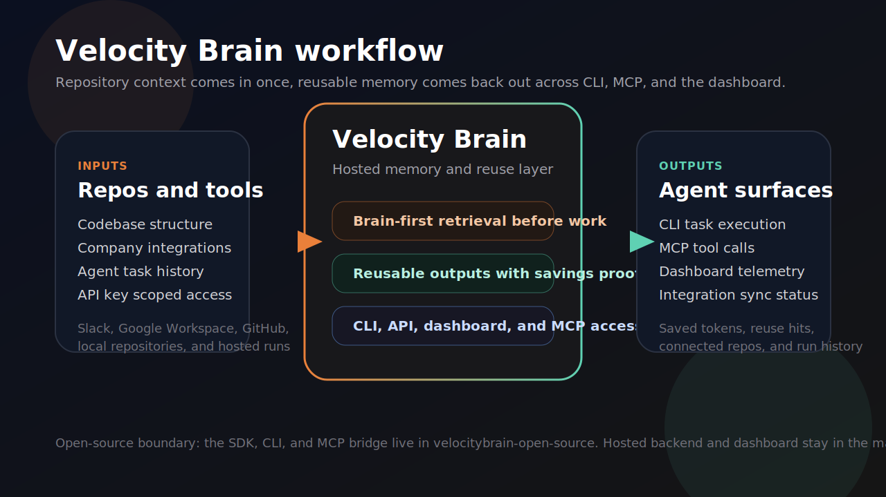
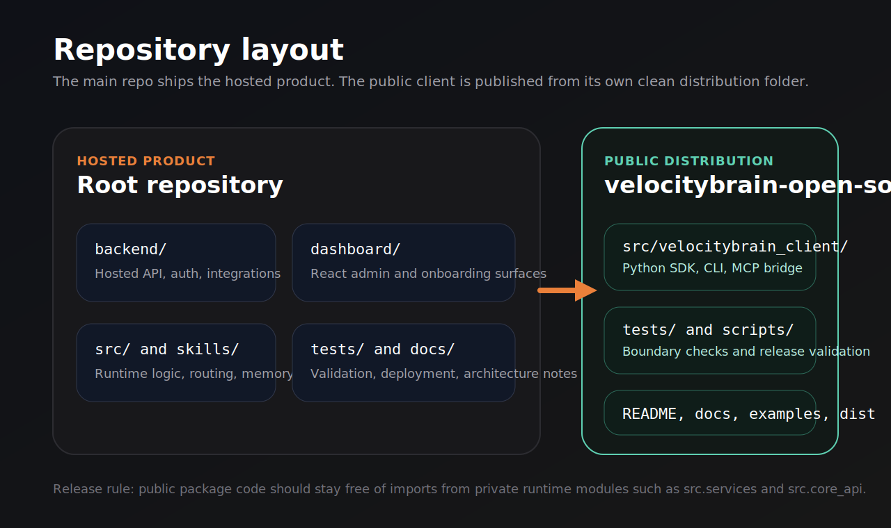

<p align="center">
  
</p>

<p align="center">
  Hosted memory and reuse for coding agents, with a dashboard, company integrations, and a publishable open-source client boundary.
</p>

<p align="center">
  
</p>

## Overview

Velocity Brain is a hosted memory and reuse layer for coding agents. It helps teams avoid paying for the same context repeatedly by retrieving useful prior work before new runs, then reporting savings and reuse proof back through the CLI, MCP surfaces, and dashboard.

This repository contains two product shapes:

- The hosted product: backend API, dashboard, onboarding, integrations, runtime logic, and internal tests.
- The public distribution boundary: `velocitybrain-open-source/`, which publishes the safe open-source client package.

## What It Includes

- Hosted API and runtime for memory-aware agent execution
- React dashboard for onboarding, API keys, usage, integrations, and agent management
- Company workspace integrations for Slack, Google Workspace, and GitHub (enabled in local dev; set `REACT_APP_INTEGRATIONS_COMING_SOON=true` to hide UI)
- Public Python client, CLI, and MCP bridge under `velocitybrain-open-source/`
- Documentation, packaging, examples, and repo-boundary checks

## Workspace Flow

### Individual workspace

1. Create an account and choose `Individual`.
2. Finish onboarding and workspace defaults.
3. Generate an API key.
4. Pair an agent locally.
5. Monitor usage, repositories, and runs in the dashboard.

### Company workspace

1. Choose `Company workspace`.
2. Complete onboarding and workspace defaults.
3. Connect Slack, Google Workspace, and GitHub (demo mode without OAuth secrets; live OAuth when configured in `backend/.env`).
4. Generate scoped API keys for teammates or agents.
5. Track sync state, connected sources, and agent activity from the dashboard.

## Repository Layout

<p align="center">
  
</p>

- `backend/`: hosted API, auth, integrations, persistence, and operational services
- `dashboard/`: React dashboard and onboarding surfaces
- `src/`: core runtime and CLI entrypoints for the hosted product
- `skills/`: skill registry and workflow definitions
- `tests/`: root test suite for the hosted repo
- `docs/`: architecture, deployment, API, client integration, and boundary documentation
- `velocitybrain-open-source/`: public package with its own `src/`, tests, docs, examples, and release artifacts

The split is intentional. Public package code is tested separately so we can publish a client safely without leaking private backend or runtime modules.

## Quick Start

### Hosted repo development

```powershell
python -m venv .venv
.\.venv\Scripts\Activate.ps1
python -m pip install --upgrade pip
python -m pip install -r requirements.txt
python -m pip install -e .
```

If you also need the dashboard:

```powershell
npm install
npm --prefix dashboard install
npm --prefix backend install
```

### Common commands

```powershell
python -m pytest -q
npm --prefix backend run dev    # default PORT 5004 in backend/.env
npm --prefix dashboard start    # proxies to http://localhost:5004
```

Copy env templates before first run:

```powershell
copy backend\.env.example backend\.env
copy dashboard\.env.example dashboard\.env
```

Keep `PORT`, `BACKEND_PUBLIC_URL`, `REACT_APP_API_URL`, and `dashboard/package.json` `proxy` on the **same port** (5004 for this repo’s local default).

## Open-Source Client

The public client lives in [`velocitybrain-open-source`](velocitybrain-open-source/README.md). It publishes `velocitybrain-client` and contains:

- `velocitybrain` CLI
- `velocitybrain-mcp` bridge
- `VelocityBrainClient` Python SDK
- examples and MCP config templates
- release checks that enforce the public/private import boundary

Public package validation from that folder:

```powershell
cd velocitybrain-open-source
python -m pytest -q
python scripts/check_public_boundary.py
python -m build --no-isolation
```

## Dashboard Surfaces

- `/onboarding`: workspace setup and integration connection flow
- `/dashboard`: overview metrics and workspace health
- `/dashboard/api-keys`: scoped API key creation and agent pairing
- `/dashboard/agents`: connected agents, repositories, runs, and telemetry
- `/dashboard/integrations`: connect, resync, and disconnect company sources (demo mode without OAuth env vars)
- `/dashboard/usage`: model usage, spend, and attribution

## Documentation

- [Architecture](docs/ARCHITECTURE.md)
- [API Design](docs/API_DESIGN.md)
- [Database Schema](docs/DB_SCHEMA.md)
- [Client Integrations](docs/CLIENT_INTEGRATIONS.md)
- [Production Deployment](docs/PRODUCTION_DEPLOYMENT.md)
- [Skill System](docs/SKILL_SYSTEM.md)
- [Repo Boundary](docs/REPO_BOUNDARY.md)
- [Public Docs](docs/public/README.md)

## Notes

- Root repo commands and the public package commands are different on purpose.
- The public package requires `VELOCITYBRAIN_API_KEY` for hosted API and MCP access.
- If Velocity Brain memory tooling is unavailable locally, run `velocitybrain doctor` after configuring credentials.

## License

MIT
