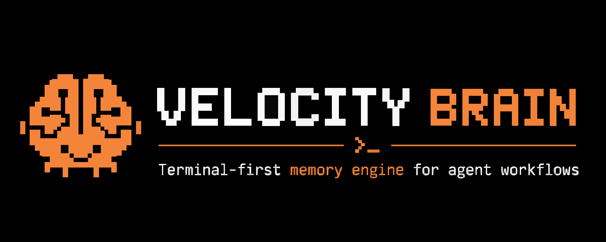
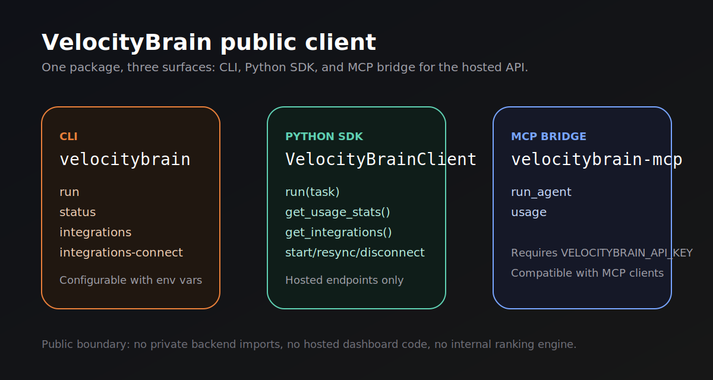

# VelocityBrain Client

<p align="center">
  
</p>

<p align="center">
  Open-source CLI, Python SDK, and MCP bridge for the hosted Velocity Brain API.
</p>

<p align="center">
  
</p>

`velocitybrain-open-source` is the public distribution boundary for Velocity Brain. The main repository contains hosted backend and dashboard code as well, but this folder is the safe publishable client package: `velocitybrain-client`.

## What This Package Is

This package gives developers a clean way to talk to the hosted Velocity Brain service from scripts, terminals, and MCP-compatible clients.

It includes:

- a Python SDK for hosted API calls
- a `velocitybrain` CLI for running tasks and checking integration state
- a `velocitybrain-mcp` bridge for MCP-compatible tools
- examples and integration templates
- tests and a public/private boundary check

It does not include:

- hosted backend services
- dashboard code
- private ranking or reuse internals
- internal operational tooling
- local/self-hosted memory storage

## Package Surface

The public client is intentionally small and hosted-only.

### CLI commands

- `velocitybrain run <task>`
- `velocitybrain status`
- `velocitybrain integrations`
- `velocitybrain integrations-connect <provider>`
- `velocitybrain config --set-key <key>`

### Python client methods

- `run`
- `get_status`
- `get_health`
- `get_usage_stats`
- `get_integrations`
- `get_integration_status`
- `start_integration`
- `resync_integration`
- `disconnect_integration`

### MCP tools

- `run_agent`
- `usage`

## Installation

Install from PyPI:

```bash
pip install velocitybrain-client
```

Install for local development:

```bash
pip install -e ".[dev]"
```

Requirements:

- Python `>=3.11`
- a valid `VELOCITYBRAIN_API_KEY`
- network access to the hosted Velocity Brain base URL

## Configuration

The client reads credentials from either environment variables or a local config file.

### Environment variables

macOS or Linux:

```bash
export VELOCITYBRAIN_API_KEY="vb_live_xxx"
export VELOCITYBRAIN_BASE_URL="https://velocity.linkitapp.in"
```

PowerShell:

```powershell
$env:VELOCITYBRAIN_API_KEY="vb_live_xxx"
$env:VELOCITYBRAIN_BASE_URL="https://velocity.linkitapp.in"
```

`VELOCITYBRAIN_BASE_URL` is optional. If omitted, the client defaults to `https://velocity.linkitapp.in`.

### Saved local config

You can also save credentials locally with the CLI:

```bash
velocitybrain config --set-key vb_live_xxx
velocitybrain config --set-key vb_live_xxx --base-url https://your-hosted-base-url
```

This writes `~/.velocitybrain/config.json`.

## Quick Start

Run a hosted task:

```bash
velocitybrain run "Map the hosted auth and API key flow in this repo."
```

Request machine-readable output:

```bash
velocitybrain --json --response-style lite run "Summarize the API key flow."
```

Check hosted usage and reuse metrics:

```bash
velocitybrain status
```

List connected integrations:

```bash
velocitybrain integrations
```

Start an integration flow:

```bash
velocitybrain integrations-connect slack
velocitybrain integrations-connect google
velocitybrain integrations-connect github
```

`integrations-connect` can open the browser automatically when the hosted API returns an `authUrl`.

## CLI Reference

### `velocitybrain run`

Runs a hosted coding task through Velocity Brain.

```bash
velocitybrain run "Review the auth boundary in this repo."
velocitybrain --response-style full run "Explain the integration setup."
velocitybrain --json run "Summarize the last implementation area."
```

Normalized output fields:

- `result`
- `reused`
- `reuse_confidence`
- `tokens_saved`
- `percent_saved`

### `velocitybrain status`

Returns hosted usage and reuse metrics.

```bash
velocitybrain status
velocitybrain --json status
```

### `velocitybrain integrations`

Lists the account's connected company integrations.

```bash
velocitybrain integrations
velocitybrain --json integrations
```

### `velocitybrain integrations-connect`

Starts a provider-specific connection flow for:

- `slack`
- `google`
- `github`

```bash
velocitybrain integrations-connect slack
```

### `velocitybrain config`

Stores local credentials for future CLI runs.

```bash
velocitybrain config --set-key vb_live_xxx
velocitybrain config --set-key vb_live_xxx --base-url https://velocity.linkitapp.in
```

## Python SDK

```python
from velocitybrain_client import VelocityBrainClient

with VelocityBrainClient(api_key="vb_live_xxx") as client:
    result = client.run(
        "Map the hosted auth and API key flow in this repo.",
        response_style="lite",
    )
    print(result)

    usage = client.get_usage_stats()
    print(usage)

    integrations = client.get_integrations()
    print(integrations)
```

The client authenticates against the hosted API, manages bearer tokens, retries transient failures, and normalizes `run` responses into a stable savings-oriented shape.

## Error Handling

The SDK exposes typed exceptions from `velocitybrain_client.client.exceptions`, including:

- `VelocityBrainError`
- `AuthenticationError`
- `RateLimitError`
- `APIError`
- `ConfigurationError`
- `NetworkError`

Example:

```python
from velocitybrain_client import VelocityBrainClient
from velocitybrain_client.client.exceptions import VelocityBrainError

try:
    with VelocityBrainClient(api_key="vb_live_xxx") as client:
        print(client.run("Summarize the auth flow."))
except VelocityBrainError as exc:
    print(f"VelocityBrain request failed: {exc}")
```

## MCP Bridge

Start the MCP bridge:

```bash
velocitybrain-mcp
```

The public bridge exposes only these tools:

- `run_agent`
- `usage`

It requires `VELOCITYBRAIN_API_KEY` to be set before launch.

Minimal MCP config:

```json
{
  "mcpServers": {
    "velocitybrain": {
      "command": "velocitybrain-mcp",
      "args": []
    }
  }
}
```

Included templates:

- `integrations/mcp/mcpServers.velocitybrain.json`
- `integrations/openclaw/mcpServers.json`
- `integrations/claude/setup.sh`

## Hosted API Surface

The public package is limited to the hosted endpoint families used by the SDK:

- `POST /v1/auth/authorize`
- `POST /v1/auth/refresh`
- `POST /v1/run`
- `GET /v1/usage`
- `GET /api/integrations`
- `GET /api/integrations/:provider/status`
- `POST /api/integrations/:provider/start`
- `POST /api/integrations/:provider/resync`
- `POST /api/integrations/:provider/disconnect`

## Development

Install editable dependencies:

```bash
pip install -e ".[dev]"
```

Run the public package checks:

```bash
pytest
python scripts/check_public_boundary.py
python -m build --no-isolation
```

The boundary check ensures the public package does not import private runtime modules from the main product repository.

## Repository Structure

```text
velocitybrain-open-source/
|-- src/velocitybrain_client/
|-- tests/
|-- examples/
|-- integrations/
|-- docs/
|-- scripts/
`-- pyproject.toml
```

Key paths:

- `src/velocitybrain_client/cli/main.py`: CLI implementation
- `src/velocitybrain_client/client/client.py`: hosted SDK
- `src/velocitybrain_client/mcp/server.py`: MCP bridge
- `tests/`: package surface and boundary checks
- `examples/basic_usage.py`: minimal SDK example

## Additional Documentation

- [Quick start](docs/getting-started.md)
- [Contributing](CONTRIBUTING.md)
- [License](LICENSE)

## Notes

- This package is hosted-client only; it is not the full Velocity Brain product.
- The README is intentionally limited to commands and methods implemented in this folder.
- If packaging fails locally, confirm your environment has `build`, `setuptools`, and `wheel` installed.

## License

MIT
